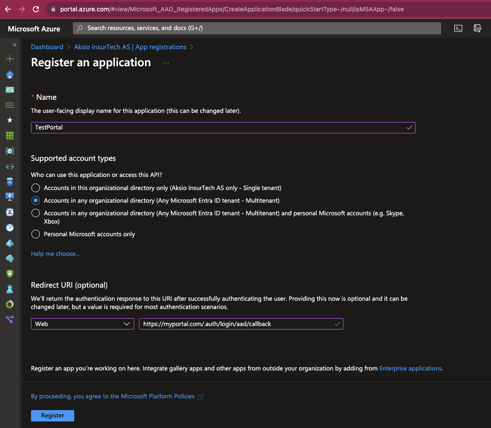
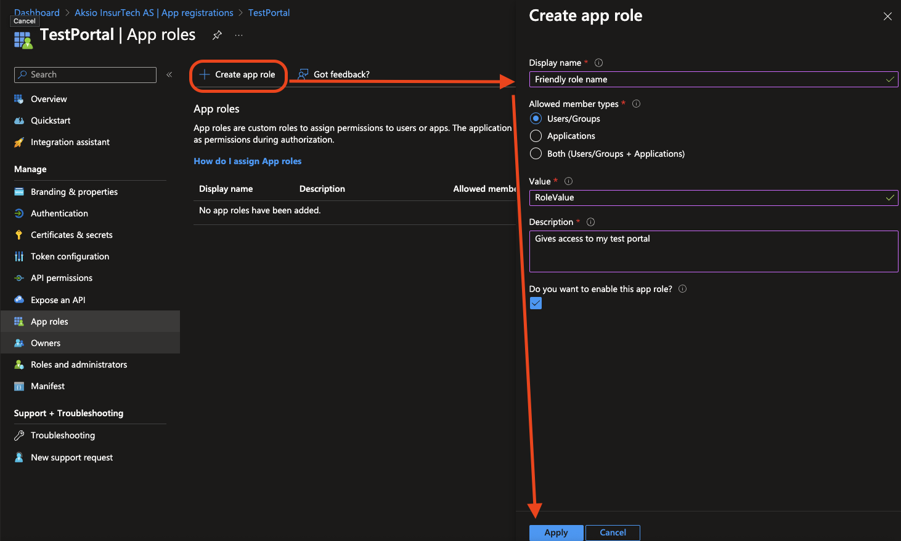
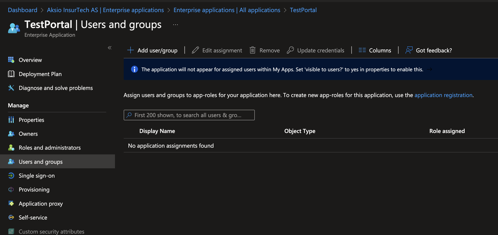
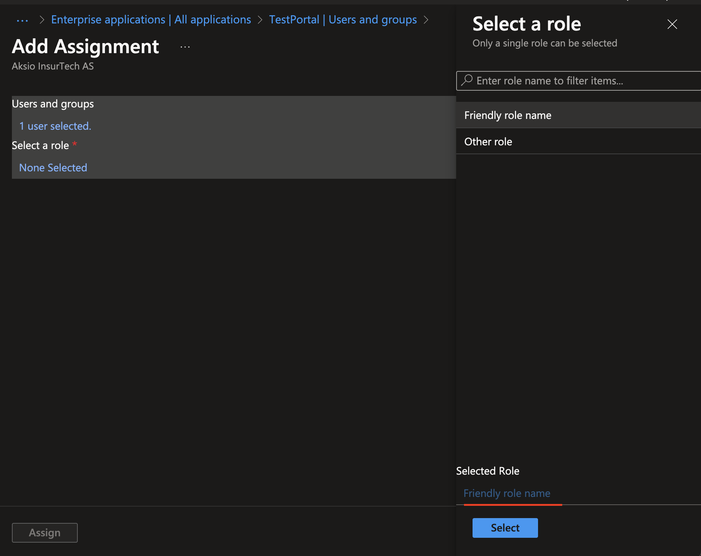
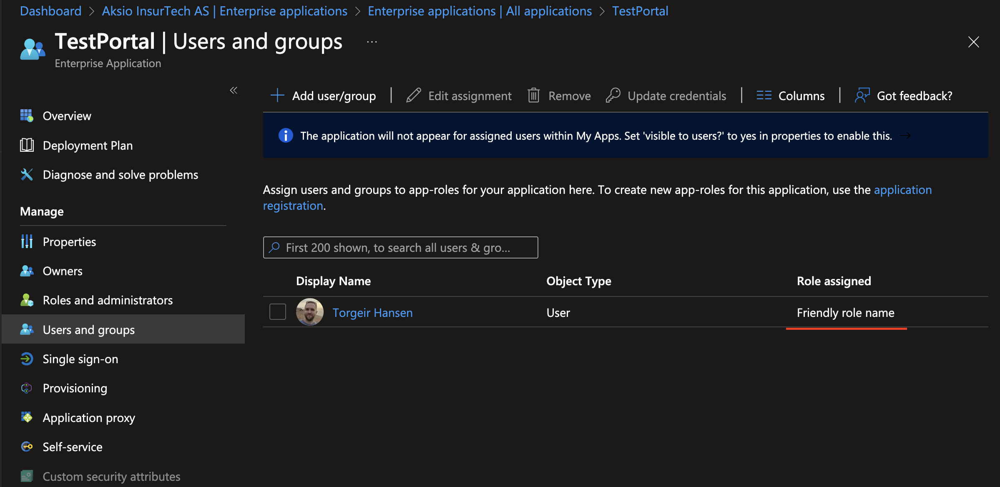

# Setting up a multi-tenanted Entra ID application with roles

Here is a step by step instruction on how to set up a multi-tenanted Entra Id application, with a role and then assignment to it.

This is a two-step process, where you will first do a `App Registration` and define one or more roles to it. 
The app registration defines the application and its parameters.

The second step is to go into the enterprise application representation of your app (which is exactly what your partner/customers will see in their Entra ID's as well after a user has attempted to access your application).

## Application registration

First, in the azure portal, go to `Entra Id` and then `App registrations` and click `New registration`. 
This will give you this dialog, where you can define its name, select if it should be single or multi-tenanted, and put in the redirect uri for the web application.

It should look something like this:

Then find `App Roles` on the menu for your application, and select `Create app role`.
Here you can enter a friendly name, select that it should be assignable to users, enter the value itself (this is important, as this is the role name you configure to allow), and some description.

It should look something like this:

Once this is done you are ready to modify the enterprise app registration in entra id.

## Enterprise application setup

In the azure portal, go to `Entra Id` and then `Enterprise applications`. 

Find your app, and then select `Users and groups`.

Click `Add user/group` to continue. 

In this dialog you can add your user(s) (or group(s)) before selecting roles it should look something like this: 
_Please note that if you only have one role in your app, it will be selected by default and the role selector panel will not be available_

Then assign, and you are done.
The user list should look something like this, note the `Role assigned` column.

 Now you can configure the ingress middleware to accept the role value you configured in your app (in this example, `RoleValue` is the value used).
