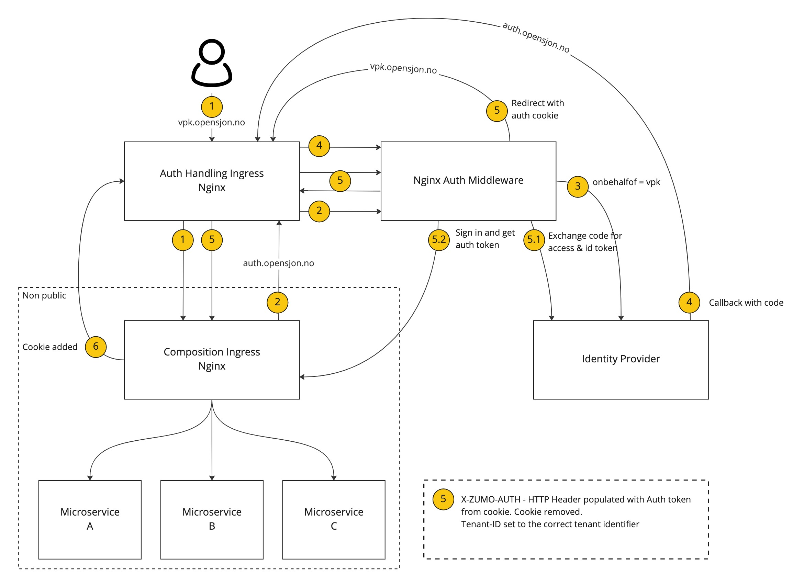
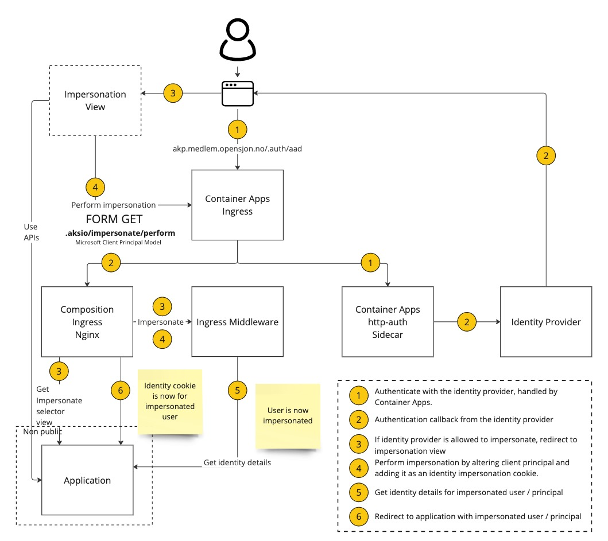

# Aksio IngressMiddleware

[](https://github.com/aksio-insurtech/IngressMiddleware/actions/workflows/dotnet-build.yml)
[](https://github.com/aksio-insurtech/IngressMiddleware/actions/workflows/publish.yml)
[](https://hub.docker.com/r/aksioinsurtech/ingressmiddleware)

This repository holds a middleware used in the hosted environment @ Aksio.

## Running locally

The middleware can be run by navigating to the `./Source` folder and do:

```shell
dotnet run
```

For testing the middleware in a reverse proxy situation, you can run the Docker Compose in `./Sample`:

```shell
docker compose up
```

This will give you a reverse proxy set up on port 8080. Navigate your browser to [http://localhost:8080](http://localhost:8080).

## Auth

The middleware is meant to be plugged into reverse proxy solutions such as Nginx. By leveraging something like the
[auth capability of Nginx](https://nginx.org/en/docs/http/ngx_http_auth_request_module.html) the middleware will be
called on every request going in and will then mutate the response if needed.

## Tenant-ID

Part of the middleware is to provide the correct `Tenant-ID` HTTP header as required by [Cratis](https://github.com/aksio-insurtech/Cratis).
It is used internally to map the current **execution context** to the current tenant for the request going in.

The `Tenant-ID` is mapped based on the domain host name which is configured in the config file. Based on the requests domain name, the correct `Tenant-ID` will be set.

To test the `Tenant-ID` injection in the response you can simply add your configured hosts to the operating systems hosts file to point to localhost/127.0.0.1 and then navigate to the URL + port 8080 with the sample reverse proxy setup.

## Id-Porten

The support for Id-Porten is based on a container app setup of a custom ingress that sits in front of the ingress for a Container App.
Its purpose is to provide support for multi tenancy for this specific identity provider by adding on the custom `onbehalfof` based on
a domain configuration for the tenant. It uses the domain name configured in the config as a basis to understand which value to set.

Below is the target flow it has been designed for:



You can read more about the `onbehalfof` support for Id-porten [here](https://docs.digdir.no/docs/idporten/oidc/oidc_api_admin_leverandør.html#1-onbehalfof-i-id-porten) (Norwegian,
English OIDC summary can be found [here](https://docs.digdir.no/docs/idporten/oidc/oidc_guide_english)).

## Config File

All configuration is done through a well known file called `config.json` sitting in the `config` folder next to the binaries of the middleware.
To override it in a running environment all you need to do is mount a volume that overrides either the `config` folder or the specific `config/config.json` file.

Its format is:

```json
{
    "idPorten": {
        "issuer": "The URL for the issuer, typically where the /.well-known/openid-configuration sits",
        "authorizationEndpoint": "The Id-porten authorization endpoint"
    },
    "tenants": {
        "<tenant guid>": {
            "domain": "fully qualified host string",
            "onBehalfOf": "Value to use for id-porten as behalf of",
            "sourceIdentifiers": []
        }
    },
    "tenantResolution": {
        "strategy": "route | claim",
        "options": {}
    },
    "identityProviderUrl": "The URL to call to get application details for the identity",
    "OAuthBearerTokens": {
        "authority": "The URL for the well-known document that describes the authority"
    },
    "mutualTLS": {
      "authorityCertificate": "base64 representation of root certificate to validate against",
      "acceptedSerialNumbers": [
        "serial1",
        "serial2"
      ]
    },
    "impersonation": {
        "identityProviders": [
            "aad"
        ],
        "authorization": {
            "tenants": [
                "<tenant guid>"
            ],
            "roles": [
                "<role string>"
            ],
            "groups": [
                "<group string>"
            ],
            "claims": [
                {
                    "type": "<claim type>",
                    "value": "<claim value>"
                }
            ]
        }
    }
}
```

### Tenant resolution

Within every tenant you'll see an optional array of source identifiers (`sourceIdentifiers`).
These are strings that can will be matched with a value provided by a source identifier provider.
If a tenant has a source identifier in its array, that tenant will become the tenant selected.

You can also use the host name as a matching criteria, which is specified as `domain` in the configuration file.
If no source identifier provider is specified, or they are not able to resolve and the `domain` value is set
it will match the tenant on this.

Configuration of source providers is done through the `tenantResolution` key. This is entirely optional and
will revert to `none` if not configured. If no provider is specified, the tenant will be resolved to an
empty string.

#### Route source identifier provider

Route values can be extracted using regular expression to provide a source identifier that will be mapped.
In the regular expression you will have to provide an expression that contains a named group. If an expression
is matched, it will use the named groups value as the source identifier for matching up the tenant.

Below shows an example:

```json
{
    "tenantResolution": {
        "strategy": "route",
        "options": {
            "regularExpression": "\/(?<sourceIdentifier>[\\w]+)\/"
        }
    }
}
```

#### Claim source identifier provider

You can configure using claims on the principal in the `x-ms-client-principal` as the source identifier for
resolving a tenant. The claim-type supported for this is the one defined by Microsoft for tenant (http://schemas.microsoft.com/identity/claims/tenantid).

Below shows an example:

```json
{
    "tenantResolution": {
        "strategy": "claim",
        "options": { }
    }
}
```

#### Specified source identifier provider

You can configure using a specific tenant id, typically used for single tenanted solutions or solutions that manage tenancy themselves and
there is no need for a tenant being passed on the request.

Below shows an example:

```json
{
    "tenantResolution": {
        "strategy": "specified",
        "options": { 
            "tenantId": "a18238e0-d78a-4f27-9bb7-8d6aa7440f1e"
        }
    }
}
```

The value in `tenantId` will then **always** be the value passed further in.

### OAuth Bearer Tokens

The `oAuthBearerToken` configuration is optional. It won't run any authorization if the config is left out.

> Note: The specific identity provider configurations are optional. You can have either or all.

### Mutual TLS / Client Certificate

The `mutualTLS` configuration is optional.

If used, a `authorityCertificate` needs to be specified in base64 format.
For get the appropriate value use with virksomhetssertifikat in test environment, you can use this command: 
```sh
curl -s http://crt.test4.buypass.no/crt/BPClass3T4RotCA.cer --output - |base64
```
For production, use this command:
```sh
curl -s https://crt.buypass.no/crt/BPClass3Rot.cer --output - |base64
```

And then the `acceptedSerialNumbers` must be set, if you have the certificate and are unsure of the serial number you can use an online tool like this: https://www.sslshopper.com/certificate-decoder.html.

### Identity Details

The result coming from the application specific identity details endpoint called ends up as a cookie with the string representation of what was returned.
The cookie name is `.aksio-identity`.

### Impersonation

The ingress middleware supports an impersonation flow, if configured for it.
This allows you to typically have your regular flow go through the identity provider(s) you want for your users and dedicate one
or more identity providers for logging in as a user in the regular flow.

The flow for this as follows:



#### Authorization of users allowed to impersonate

There are a few ways to limit what users are allowed to impersonate other users.

##### Identity Provider

You configure in the `config.json` under `impersonation` which identity provider(s) are allowed to perform impersonation.
This information is typically found as a claim called `auth_type` in the client principal coming from the Microsoft Identity platform.
If none are configured, impersonation is not allowed.

##### Tenants

The user resolves to a tenant from the tenancy mapping. You can filter what tenants are allowed.
If none are configured, this filter is ignored.

##### Roles

The user can have roles associated with it. You can filter what role(s) the user needs to have.
This resolves based on the the claim called `roles`.
If none are configured, this filter is ignored.

##### Groups

The user can have groups associated with it. You can filter what group(s) the user needs to have.
This resolves based on the the claim called `groups`.
If none are configured, this filter is ignored.

##### Claims

Part of the principal from the Microsoft Identity platform are a collection of claims.
You can filter based on claim(s), specific types and values.
If none are configured, this filter is ignored.

#### Claims replacing

Impersonation happens by replacing claims that is later used as part of the request towards the identity details.
The claims are replaced in the principal of the currently logged in user. This means that if you're using an identity provider that
is different and does not offer the same claims as the one for your regular user flow, you will have to provide these claims in the
route for performing the actual impersonation.

The claims should be part of the HTML FORM being sent to the server. The FORM accepts a GET request, meaning you'll have to include
the FORM values in the query string.

#### UI

For impersonation you'll need a UI that can present to the user a way to impersonate a specific user.
The impersonation UI is expected to be at `/.aksio/impersonate`.

In your HTML you would typically then have a form that looks like the following:

```html
<form action="/.aksio/impersonate/perform" method="GET">
    <label for=""ssn">Enter name to impersonate:</label><br>
    <input type="text" name="claim:name" id="name" placeholder="Name" /><br>
    <label for=""ssn">Enter Social Security Number to impersonate:</label><br>
    <input type="text" name="claim:pid" id="ssn" placeholder="Social Security Number" />
    <button>Impersonate</button>
</form>
```

The FORM action is set to `/.aksio/impersonate/perform` and uses `GET` as method.
All the claims you want to override have to be prefixed with `claim:` in the name of the
input field.

#### Cookies

When a user has completed the impersonation flow, a cookie is added called `.aksio-identity-impersonation`.
This cookie will be used in subsequent requests and will replace the `x-ms-client-principal` header with the value
of the cookie.
