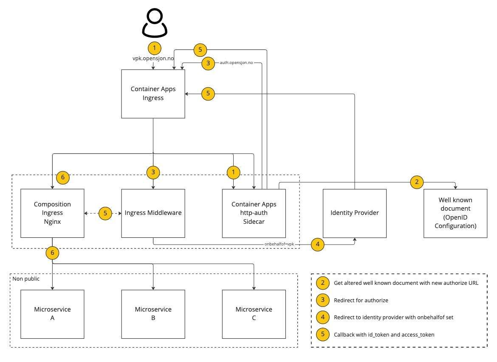

# Aksio IngressMiddleware

[](https://github.com/aksio-insurtech/IngressMiddleware/actions/workflows/dotnet-build.yml)
[](https://github.com/aksio-insurtech/IngressMiddleware/actions/workflows/publish.yml)
[](https://hub.docker.com/r/aksioinsurtech/ingressmiddleware)

This repository holds a middleware used in the hosted environment @ Aksio.

## Running locally

The middleware can be run by navigating to the `./Source` folder and do:

```shell
dotnet run
```

For testing the middleware in a reverse proxy situation, you can run the Docker Compose in `./Sample`:

```shell
docker compose up
```

This will give you a reverse proxy set up on port 8080. Navigate your browser to [http://localhost:8080](http://localhost:8080).

## Auth

The middleware is meant to be plugged into reverse proxy solutions such as Nginx. By leveraging something like the
[auth capability of Nginx](https://nginx.org/en/docs/http/ngx_http_auth_request_module.html) the middleware will be
called on every request going in and will then mutate the response if needed.

## Tenant-ID

Part of the middleware is to provide the correct `Tenant-ID` HTTP header as required by [Cratis](https://github.com/aksio-insurtech/Cratis).
It is used internally to map the current **execution context** to the current tenant for the request going in.

The `Tenant-ID` is mapped based on the domain host name which is configured in the config file. Based on the requests domain name, the correct `Tenant-ID` will be set.

To test the `Tenant-ID` injection in the response you can simply add your configured hosts to the operating systems hosts file to point to localhost/127.0.0.1 and then navigate to the URL + port 8080 with the sample reverse proxy setup.

## Id-Porten

The support for Id-Porten is based on a container app setup of a custom ingress that sits in front of the ingress for a Container App.
Its purpose is to provide support for multi tenancy for this specific identity provider by adding on the custom `onbehalfof` based on
a domain configuration for the tenant. It uses the domain name configured in the config as a basis to understand which value to set.

This part of the middleware is designed to work with the [client-directed sign-in process](https://learn.microsoft.com/en-us/azure/container-apps/authentication#client-directed-sign-in)
supported by the Container App sidecar container.

Below is the target flow it has been designed for:



You can read more about the `onbehalfof` support for Id-porten [here](https://docs.digdir.no/docs/idporten/oidc/oidc_api_admin_leverandør.html#1-onbehalfof-i-id-porten) (Norwegian,
English OIDC summary can be found [here](https://docs.digdir.no/docs/idporten/oidc/oidc_guide_english).

## Config File

All configuration is done through a well known file called `config.json` sitting in the `config` folder next to the binaries of the middleware.
To override it in a running environment all you need to do is mount a volume that overrides either the `config` folder or the specific `config/config.json` file.

Its format is:

```json
{
    "idPorten": {
        "callback": "Callback url to tell Id-porten to call back to",
        "authorizationEndpoint": "The Id-porten authorization endpoint",
        "tokenEndpoint": "The Id-porten token endpoint",
        "clientId": "The client Id to use for getting id/access tokens",
        "clientSecret": "The client secret to use for getting id/access tokens",
        "authName": "Name of auth in Container App"
    },
    "tenants": {
        "<tenant guid>": {
            "domain": "<host string>",
            "onBehalfOf": "Value to use for id-porten as behalf of"
        }
    }
}
```
